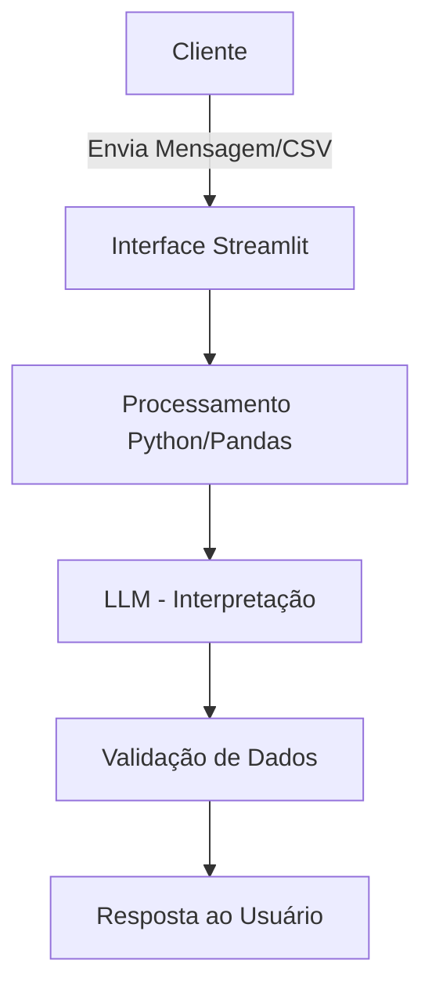

# 🧩 CASO DE USO: CASHFLOW INSIGHT AI

---

## 🔎 PROBLEMA
**Qual problema financeiro seu agente resolve?**

Pequenas empresas e empreendedores têm dificuldade em entender claramente seu fluxo de caixa. Muitas vezes possuem registros de transações, mas não conseguem identificar:

* **Visibilidade:** Quanto realmente ganharam ou gastaram no período.
* **Impacto:** Qual categoria mais consome o orçamento.
* **Saúde:** Se o saldo está saudável ou em risco iminente.
* **Eficiência:** Onde exatamente podem reduzir custos.

> ⚠️ **Consequência:** A falta dessa visão gera decisões financeiras baseadas em percepção ou "feeling", e não em dados reais.

---

## 💡 SOLUÇÃO
**Como o agente resolve esse problema de forma proativa?**

O agente analisa automaticamente um arquivo CSV e executa as seguintes etapas:

1.  **Cálculos Determinísticos:** * Soma total de entradas, saídas e cálculo do saldo líquido.
2.  **Identificação de Ofensores:** * Detecta automaticamente a categoria com maior impacto negativo.
3.  **Relatório Narrativo:** * Traduz os números em um relatório explicativo de fácil leitura.
4.  **Apoio à Decisão:** * Oferece sugestões práticas e responde dúvidas em linguagem natural.

> **Nota Técnica:** O agente **não** faz cálculos via IA (que pode errar matemática). Os cálculos são feitos via código (Python/Pandas) e a IA apenas interpreta os resultados.

---

## 🎯 PÚBLICO-ALVO
* **Pequenos empresários** e Microempreendedores Individuais (MEI).
* **Startups** em fase inicial de operação.
* **Gestores administrativos** sem formação técnica em finanças.
* **Pessoas físicas** que buscam controle rigoroso de fluxo de caixa.

---

## 🗣️ PERSONA E TOM DE VOZ

### 🏷️ Nome do Agente
**CashFlow Insight AI**

### 🧠 Personalidade
* **Consultivo:** Age como um parceiro de negócios.
* **Analítico:** Foca sempre no que os dados dizem.
* **Educativo:** Explica o "porquê" por trás dos números.

### 💬 Tom de Comunicação
* **Acessível e Objetivo:** Sem "economês" difícil.
* **Direto:** Respostas claras que economizam o tempo do usuário.

---

## 🏗️ ARQUITETURA

### 🔄 Diagrama de Fluxo

### 🧱 Componentes Principais

| Componente               | Descrição                                                                       |
| ------------------------ | ------------------------------------------------------------------------------- |
| Interface                | Chatbot interativo desenvolvido em Streamlit                                    |
| Processamento Financeiro | Módulo Python responsável por cálculos determinísticos (Pandas)                 |
| LLM                      | Modelo de linguagem via API para geração de relatórios e explicações            |
| Base de Conhecimento     | Arquivo CSV contendo histórico de transações financeiras                        |
| Validação                | Checagem para garantir que a resposta está baseada apenas nos dados processados |

### 🔐 SEGURANÇA E ANTI-ALUCINAÇÃO
#### ✅ Estratégias Adotadas
Ancoragem: Responde apenas com base nos dados reais do CSV.

Cálculo Externo: A matemática é feita fora do modelo de linguagem.

Transparência: Se o dado não existe, o agente admite que não sabe.

#### ⚠️ Limitações Declaradas
🚫 Não substitui contadores ou consultoria jurídica/fiscal.

🚫 Não realiza previsões de mercado financeiro (bolsa, dólar).

🚫 Não toma decisões financeiras (apenas sugere).
